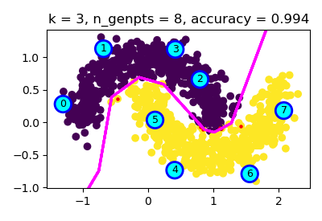
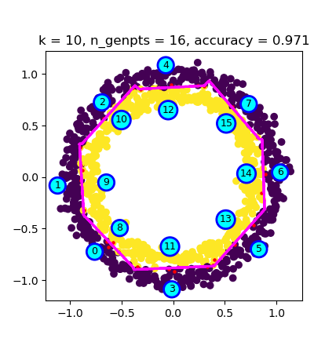
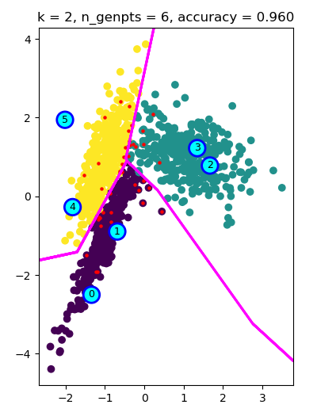

# super-k
Super-k:  A Piecewise Linear Classifier Based on Voronoi Tessellations  
[](https://doi.org/10.5281/zenodo.4460307)
[](https://arxiv.org/abs/2012.15492v2)

[comment]: # (arXiv.org non-official badge https://github.com/zsxoff/arxiv-badge)

This is the reference implementation of the Super-k algorithm. The Super-k
algorithm is a Piecewise-Linear (PWL) classification algorithm. It generates a
set of test points based on the Voronoi region idea, which are called generator points.
Then these class labeled test points can be effectively used for classification
of an input, in a SIMD fashion.





# Dependencies

## For Super-k only

- numpy

## To reproduce results of the paper

- numpy
- scipy
- matplotlib
- sklearn
- tabulate

# Usage

Interface of the library is made compatible with the Scikit-Learn library. So,
it can be easily tested against any algorithm. See examples below for usage.

## Synthetic test plots:

Run the lines below, for the generation of the test plots, which are generated
using synthetic dataset tools of the Scikit-Learn.

```
python test_moons.py
python test_circles.py
python test_random.py
```

## Generation of tables:

```
python train_validate_test.py
```

## Training steps:

```
python voxel_em_correct.py
```

## Voxels, voxel means:

```
python show_voxels_grids.py
```
